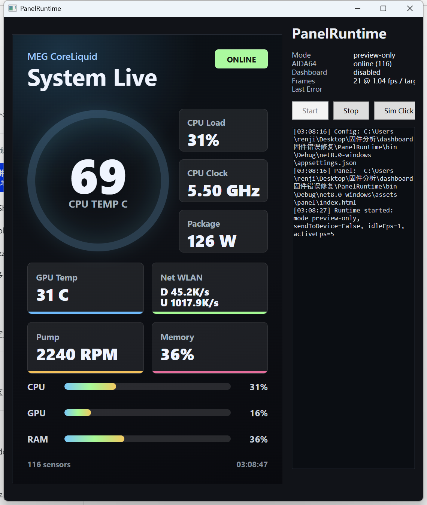
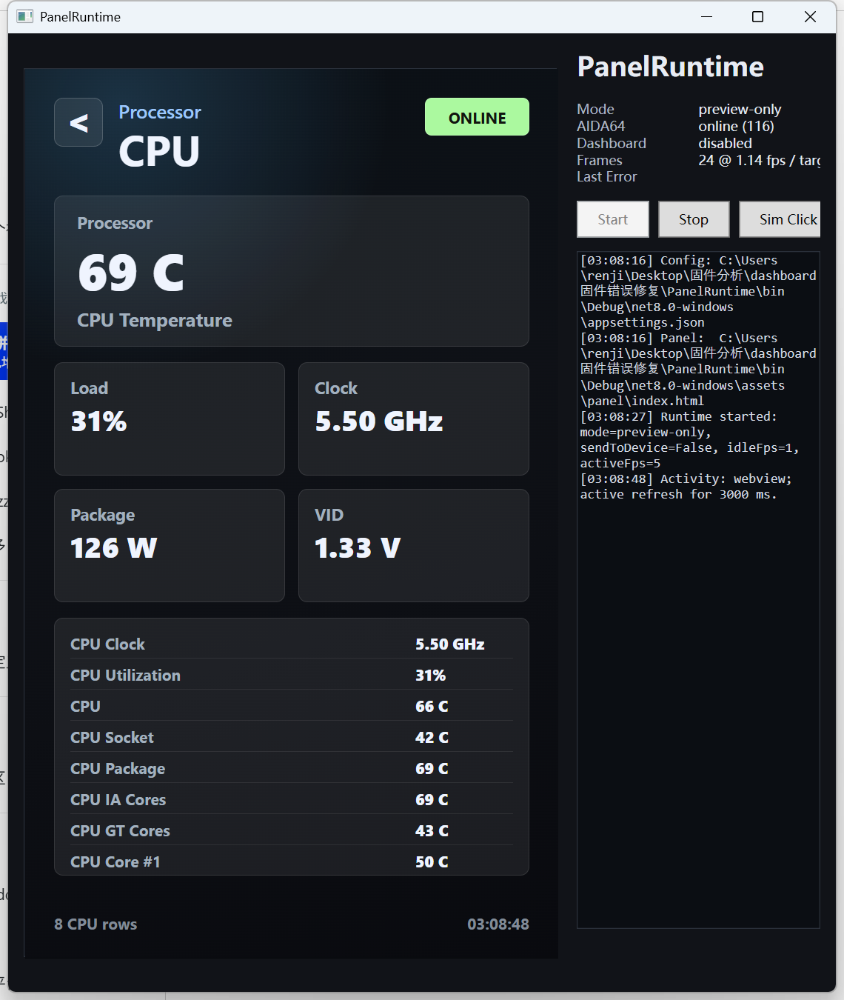
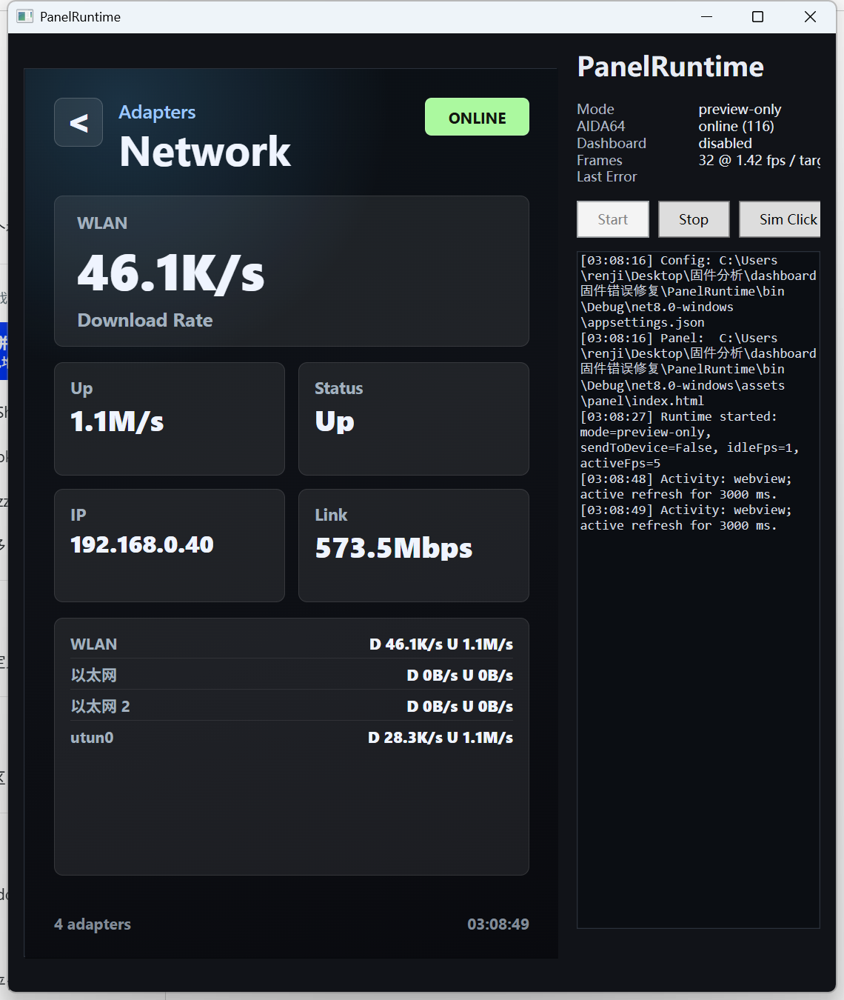
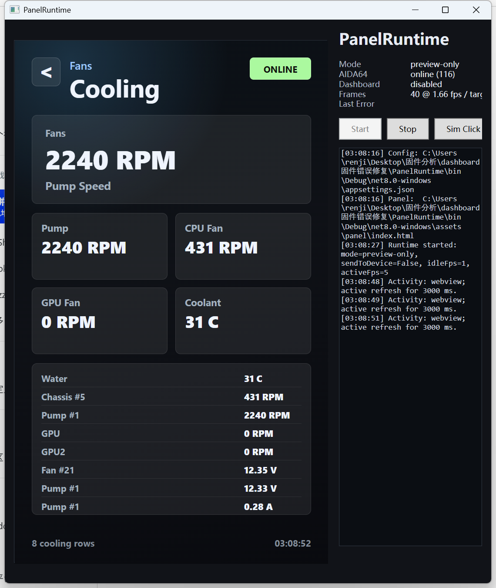

# MSI 4483 Dashboard Firmware Notes / MSI 4483 Dashboard 固件研究记录

> Unofficial research project. Use at your own risk.  
> 非官方研究项目。刷写固件有风险，请自行承担后果。

## 中文说明

这个仓库整理了 MSI 4483 Dashboard 小屏的两个长期运行 bug、对应的补丁思路，以及一个实验性的自定义显示方案。

设备信息：

- USB HID: `VID=0x0DB0 / PID=0x4BB6`
- Firmware image: `conprog_4BB6_22100300.bin`
- Panel size used by the custom runtime: `480x800`

### 发现的问题

我遇到过两个长期运行后出现的问题：

1. 小屏运行几天后卡在 `loading` 画面，断电重启也不能恢复。
2. 小屏运行一段时间后出现两个界面叠加、闪烁、画面混乱，重启后可能仍然存在。

### Bug 原理

第一个问题和固件里的版本号判断有关。主显示循环会读取当前保存的内容版本号，并和 `21010100` 比较。只要这个值匹配，固件就会跳进 loading 模式，而且没有正常退出路径。由于相关状态可能来自 NAND 内容包，状态一旦被写入，普通重启后还会再次触发。

第二个问题和显示页面 slot 的互斥逻辑有关。固件里 slot 8 和 slot 9 正常应该二选一，但有两处代码在打开 slot 8 前没有先关闭 slot 9。这样在某些更新、旋转或页面状态变化后，两个 slot 会同时处于启用状态，两套界面逻辑一起写同一个屏幕缓冲区，最终表现为叠加、闪烁或花屏。如果错误状态又写回 NAND，重启后也可能继续复现。

### 补丁思路

补丁只改 3 个位置：

1. 把触发 loading 模式的比较值从 `21010100` 改成不会正常匹配的值。
2. 在一处 slot 8 启用路径前，先清掉 slot 9 enable。
3. 在另一处相同逻辑的 slot 8 启用路径前，也先清掉 slot 9 enable。

补丁脚本会检查原始字节，只有固件内容匹配预期时才会写入修改。

### One More Thing: 自定义副屏

除了 bug 修复，这里还包含一个实验性的自定义显示方案。它的目标是把这个小屏从“只能显示 MSI 固定页面”，变成一个由电脑实时推送画面的 480x800 自定义副屏。

方案分两部分：

1. 魔改固件：在原固件基础上增加自定义 USB HID 数据通道，让电脑可以把帧数据写到小屏显示缓冲区。
2. `PanelRuntime`：Windows 上的 .NET 8 + WPF + WebView2 程序。它用网页画 UI，读取 AIDA64 和 Windows 系统状态，然后把画面推送到小屏。

它可以用于：

- 显示自定义硬件监控仪表盘。
- 展示 CPU/GPU 温度、占用率、风扇、功耗等 AIDA64 数据。
- 展示网络、硬盘、散热等 Windows 状态。
- 通过触摸切换页面。
- 平时低帧率常驻显示，交互时提高刷新率。

因为界面是普通 HTML/CSS/JS，即使程序打包后，网页资源也可以暴露出来直接修改。现在有 AI 辅助，改主题、换布局、加页面、删模块的门槛比以前低很多。

### 固件状态

- `bugfix-only`: 只包含 loading 死循环和 slot 8/slot 9 叠加闪烁修复，不包含自定义显示通道。
- `v72`: 当前较稳定基线，做过 5fps 连续 8 小时实机测试。
- `v73`: 后续候选版本，离线自检通过，但尚未完整实机验证。

建议源码仓库只记录 hash。固件二进制如果公开，建议放 GitHub Release，不直接提交到 git 历史。

### 风险

这不是官方固件，也不是官方工具。刷写错误可能导致设备不启动，甚至需要恢复工具或重新刷 NAND。没有恢复手段时，不建议直接刷写。

## English

This repository documents two long-running firmware issues found on the MSI 4483 Dashboard panel, the patching idea, and an experimental custom display runtime.

Device information:

- USB HID: `VID=0x0DB0 / PID=0x4BB6`
- Firmware image: `conprog_4BB6_22100300.bin`
- Custom runtime panel size: `480x800`

### Issues

Two long-running failures were observed:

1. The panel gets stuck on the `loading` screen after several days. Power cycling does not recover it.
2. The panel starts showing overlapping pages, flicker, or corrupted UI. Rebooting may not clear the state.

### Root Cause

The first issue is related to a firmware version check. The main display loop compares the saved content version against `21010100`. When it matches, the firmware jumps into loading mode and does not have a normal exit path. Since this state can come from NAND content updates, a reboot may simply reload the same state and trigger the loop again.

The second issue is related to display slot ownership. Slot 8 and slot 9 should be mutually exclusive, but two firmware paths enable slot 8 without first disabling slot 9. Under some update, rotation, or page-state transitions, both slots can remain enabled. Two UI pipelines then write to the same framebuffer, causing overlapping pages, flicker, or corrupted display. If the bad state is persisted to NAND, rebooting can restore the same broken state.

### Patch Idea

The patch changes only three locations:

1. Replace the loading-trigger comparison value with a value that should not normally match.
2. Clear slot 9 enable before enabling slot 8 in one path.
3. Apply the same slot 9 clear in the other matching slot 8 path.

The patch script validates the original bytes before writing any change.

### One More Thing: Custom Display Runtime

Besides the bug fix, this project also contains an experimental custom display path. The goal is to turn the MSI fixed-function panel into a 480x800 custom secondary display driven by a PC application.

It has two parts:

1. Modified firmware: adds a custom USB HID data path so the host can stream frame data into the panel display buffer.
2. `PanelRuntime`: a Windows .NET 8 + WPF + WebView2 app. It renders the UI as a web page, reads AIDA64 and Windows system data, and streams the rendered frame to the panel.

It can be used to:

- Show a custom hardware-monitoring dashboard.
- Display AIDA64 sensor values such as CPU/GPU temperature, load, fan speed, and power.
- Display Windows network, storage, and cooling information.
- Switch pages via touch input.
- Run at low FPS when idle and increase FPS during interaction.

The UI is plain HTML/CSS/JS. Even after packaging, the web assets can remain exposed and easy to edit. With AI assistance, changing themes, layouts, pages, and widgets becomes much easier than editing firmware directly.

### Firmware Status

- `bugfix-only`: fixes only the loading loop and slot 8/slot 9 overlap bugs. It does not include the custom display path.
- `v72`: current tested baseline, passed an 8-hour 5fps hardware run.
- `v73`: later candidate, offline self-check passed, not fully hardware-validated yet.

The git repository should store hashes and notes. If firmware binaries are published, GitHub Releases are preferred over committing binaries into git history.

### Risk

This is not official firmware and not an official tool. Flashing the wrong image may make the device fail to boot and may require recovery tools or NAND reflashing. Do not flash without a recovery plan.
